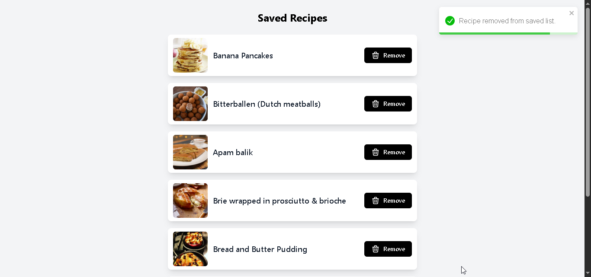

# 🍴 TheMealExplorer – Recipe Finder Web App (Recipe Ideas)

A modern and responsive Recipe Finder application built with **React**, **Redux Toolkit**, and **Tailwind CSS**.  
Users can search for recipes by **name** or **ingredient**, view full recipe details, and save their favorites.  
The app also includes a **Surprise Me** feature for random recipe suggestions.

---

## 🚀 Features
- 🔍 **Search by Name** – Quickly find recipes by entering dish names.  
- 🥕 **Search by Ingredient** – Discover recipes using specific ingredients.  
- 🎲 **Surprise Me** – Get random recipe suggestions instantly.  
- 📺 **Recipe Details** – View ingredients, instructions, and YouTube video tutorials.  
- 💾 **Save & Remove Favorites** – Manage your favorite recipes easily.  
- 🔔 **Toast Notifications** – User-friendly alerts for interactions.  
- 📱 **Responsive Design** – Works seamlessly on mobile and desktop.  

---

## 🛠️ Tech Stack
- **Frontend**: React, Redux Toolkit, Tailwind CSS  
- **Routing**: React Router DOM  
- **API Calls**: Axios (TheMealDB API)  
- **Notifications**: React Toastify  
- **Deployment**: Netlify  

---

## 📸 Screenshots

### 🔍 Home & Search


### 📖 Recipe cards


### 🎲 Saved Recipe


---

## ⚙️ Installation & Setup

1. **Clone the repository**
   ```bash
   git clone https://github.com/your-username/recipe-finder.git
   cd recipe-finder
   ```

2. **Install dependencies**
   ```bash
   npm install
   ```

3. **Start the development server**
   ```bash
   npm start
   ```

4. **Build for production**
   ```bash
   npm run build
   ```

---

## 🌐 Live Demo
👉 [View Deployed Project](https://your-netlify-link.netlify.app/)

---

## ✅ Testing Highlights
- **Functional Testing** – Verified recipe search, save/remove favorites, and random recipe.  
- **UI Testing** – Checked responsiveness and layout on mobile & desktop.  
- **API Testing** – Validated responses with Postman and handled empty search scenarios.  

---

## 📜 License
This project is licensed under the **MIT License**.

---

👨‍💻 Developed by **Razique Shaikh**
